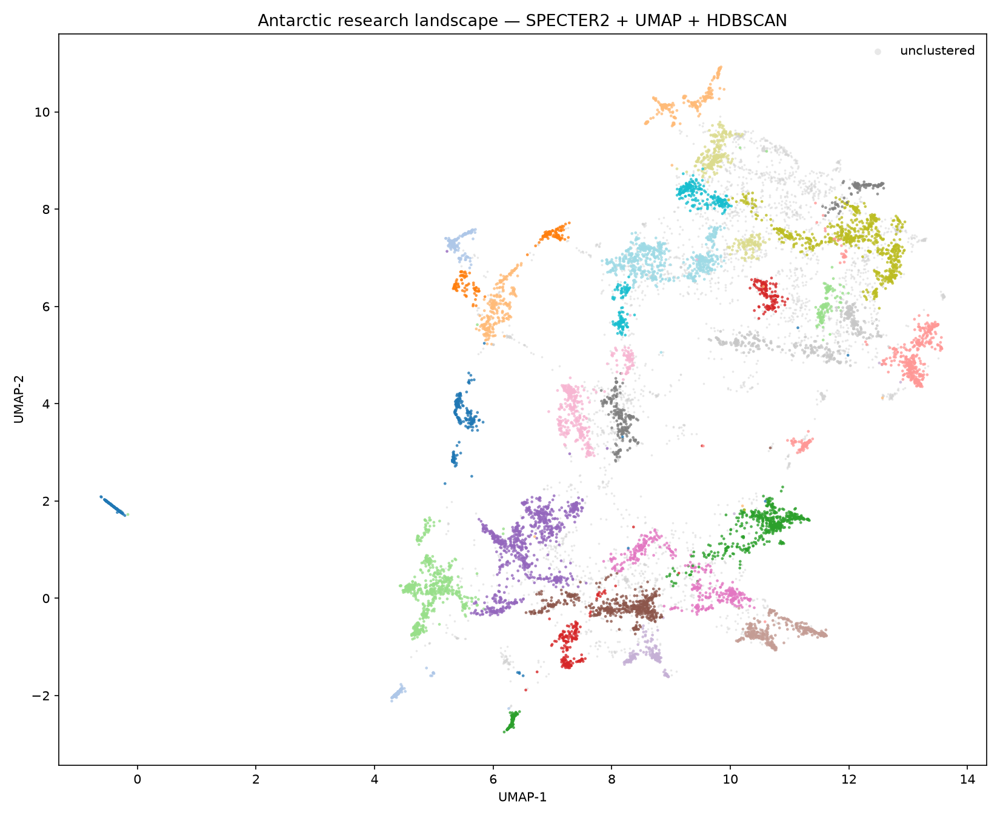
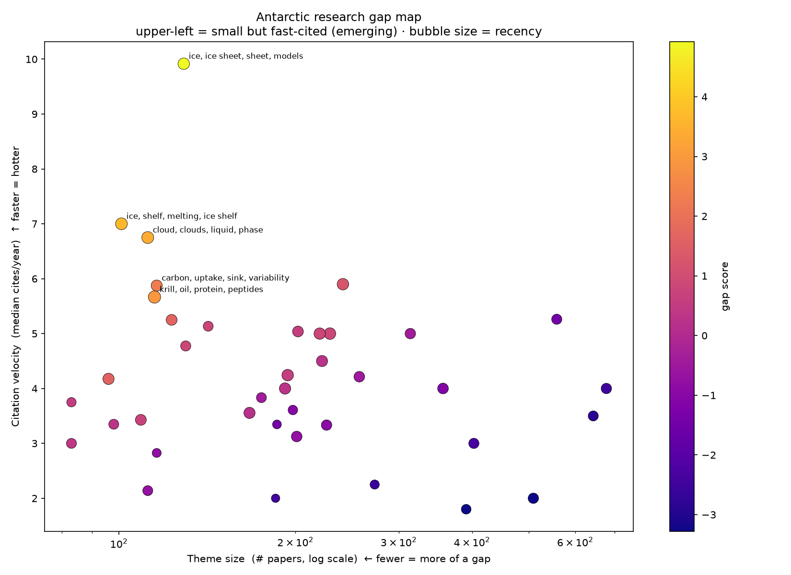

# Antarctic Research Gap Finder

Most literature reviews tell you what has already been studied. This project flips that question around: instead of summarising the past, it tries to spot where the field is heading next.

The idea is simple. A topic with very few papers but fast-growing citations is a signal that something is starting to matter to researchers, even though almost nobody has written about it yet. Low paper density plus high citation velocity gives a quantitative definition of a "research gap".

## Why Antarctica

I picked Antarctic research specifically because I'm interested in environmental data, and it's a field that's growing fast but still relatively underexplored with this kind of quantitative approach.

## Beyond Antarctica

The pipeline isn't specific to polar science. Feed it any field's papers and citation data, and it'll point to the same kind of white space, areas that are under-studied relative to how fast attention is growing.

## How it works

I take the full corpus of roughly 12k Antarctic research papers and embed each one using SPECTER2, a model built specifically for scientific-document similarity, trained on the citation graph rather than generic text. These embeddings get reduced and clustered using UMAP and HDBSCAN to map out the actual research themes in the field.

From there, the gap detector looks for clusters that are sparse (few papers) but accelerating (citations growing fast for the papers that do exist).

I aim to find out the top 3 research questions Antarctic data science hasn't answered yet.

## Results

Running the pipeline over ~12k papers (2010–2024) surfaces **39 research themes**.
Scoring each by `z(citation velocity) + 0.5·z(recency) − z(log size)` highlights the
emerging, under-explored ones:


*The Antarctic research landscape: each island is a theme found from text alone.*


*Upper-left = small but fast-cited. The bright points are the candidate gaps.*

### Three questions Antarctic data science hasn't settled yet

1. **How much will the Antarctic Ice Sheet add to sea-level rise this century, and
   what explains the still-wide spread between coupled ice-sheet–climate models?**
2. **Does Antarctic ice-shelf meltwater dampen or amplify global warming, and through
   which Southern Ocean pathways?**
3. **What controls whether Southern Ocean clouds hold liquid or ice, and would getting
   it right remove the persistent shortwave radiation bias in climate models?**

See [`outputs/report.md`](outputs/report.md) for the evidence behind each.

> **What the gap signal is and isn't:** it flags themes that are *small but
> high-impact-per-paper and recent*. It is not the same as "underfunded": a hot, well-funded topic can still be small and fast-growing.

## Pipeline

| Stage | Script | Output |
|-------|--------|--------|
| 1. Acquire | `src/fetch_openalex.py` | `data/papers.parquet` |
| 2. Embed | `src/embed.py` | `data/embeddings.npy` |
| 3. Reduce + cluster | `src/cluster.py` | `clusters.parquet`, `landscape.png` |
| 4. Label themes | `src/label.py` | `themes.csv` |
| 5. Gap detection | `src/gaps.py` | `gaps.csv`, `gap_map.png` |
| 6. Report | `src/report.py` | `report.md` (3 research questions) |

Run the whole pipeline from the project root:

```bash
python -m src.fetch_openalex   # 1. ~12k papers from OpenAlex
python -m src.embed            # 2. SPECTER2 embeddings (cached)
python -m src.cluster          # 3. UMAP + HDBSCAN
python -m src.label            # 4. c-TF-IDF theme labels
python -m src.gaps             # 5. gap scoring
python -m src.report           # 6. the 3 questions
```

## Stack

- **Data:** [OpenAlex](https://openalex.org) (open scholarly index, no API key)
- **Embeddings:** [SPECTER2](https://github.com/allenai/SPECTER2); built for
  scientific-document similarity from the citation graph
- **Clustering:** UMAP → HDBSCAN (density-based, finds natural themes *and*
  leaves sparse gaps unclustered)
- **Theme labels:** c-TF-IDF